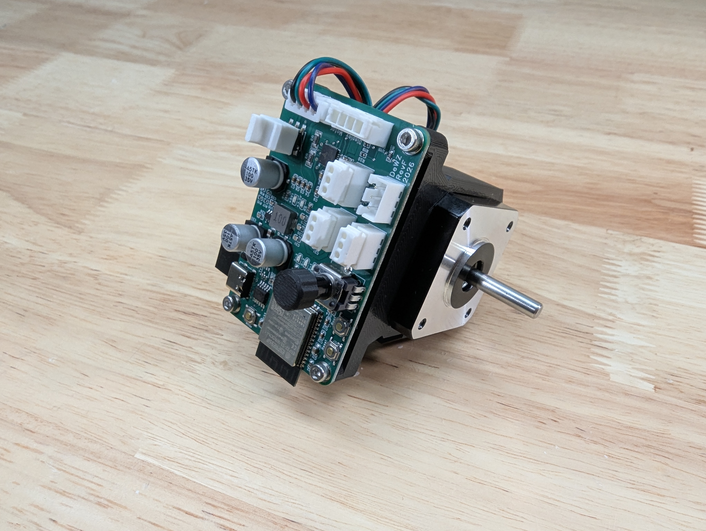
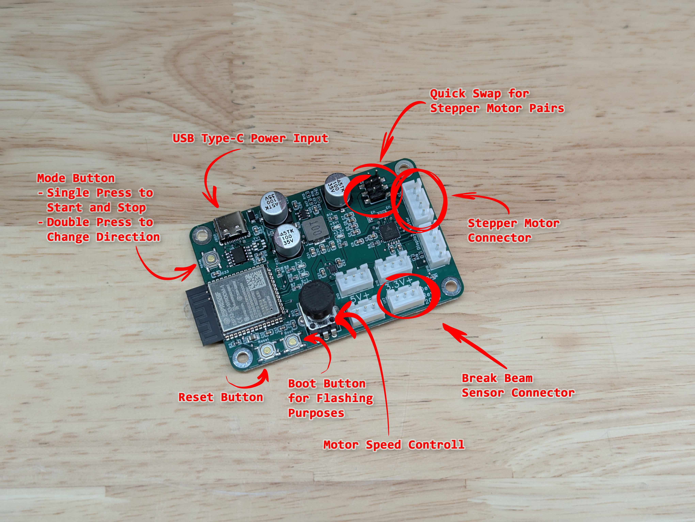
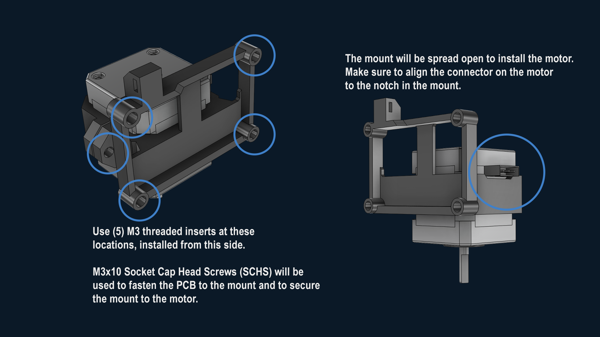

# BirdFeeder Smart Controller PCB

  

The **BirdFeeder Smart Controller** is the next generation of stepper motor controller for your BirdFeeder Bullet Feeder. Designed to work with standard USB Type-C power supplies (utilizing up to 20V with compatible PD plugs), it features standard connections for your Break-Beam sensor, Speed Adjuster, and Stepper Motor. 

The biggest change? **Built-in Wi-Fi.** If you are thinking, *"Great, another Wi-Fi device,"* we felt the same way at first! But after helping many people get the original PCB up and running, the biggest hurdle was always downloading complex software (Arduino IDE, drivers, and libraries) just to get started or push a simple update. 

The Smart Controller solves this. **You do not need any development tools or technical experience.** You can configure, control, update, and diagnose your feeder entirely through a simple web page on your phone or computer. It functions 100% offline, no internet access, mobile apps, or cloud accounts required.

Your controller will arrive ready to go, right out of the box!

---

##  Safety & Development Status

> 🛑 **Experimental Hardware Disclaimer:** This controller is currently considered a development and evaluation board. While it includes multiple safety and fault-detection features (such as break-beam stopping, jam detection, motor disable logic, and status monitoring), it has not been certified or evaluated as a commercial safety-rated control system. 
>
> Treat this as experimental hardware. Do not rely upon this controller for life safety, fire prevention, equipment protection, or unattended long-term operation. Do not leave the system operating entirely unattended. Always supervise operation during testing, tuning, and calibration.
>
> **Users are responsible for:** Providing appropriate power protection/wiring, ensuring the mechanism is mechanically safe, and inspecting the system regularly for wear or overheating.

---

##  Table of Contents
1. [Quick Start Guide](#-quick-start-guide)
2. [Main Features](#-main-features)
3. [Smart Controller Mount Installation](#%EF%B8%8F-smart-controller-mount-installation)
4. [Using the Web Control Page](#-using-the-web-control-page)
5. [Troubleshooting & Common Fixes](#-troubleshooting--common-fixes)
6. [Safety & Development Status](#%EF%B8%8F-safety--development-status)
7. [Advanced Technical Reference](#-advanced-technical-reference)

---

##  Quick Start Guide
*Ready to get going? Follow these simple steps to get up and running in less than 5 minutes.*

  

### Step 1: Plug Everything In
Connect your stepper motor and Break-Beam sensor to the board as shown in the diagram above. Then, plug in your USB Type-C power supply and wait a few seconds for the board to boot up.

### Step 2: Connect to the Setup Wi-Fi
On your phone, tablet, or computer, open your Wi-Fi settings and look for a new network:
* **Network Name (SSID):** `BirdFeeder Setup`
* **Password:** `12345678`

### Step 3: Open the Web Page
Open your favorite web browser (Safari, Chrome, Edge, etc.) and type this exact address into the top URL bar:
**[http://192.168.4.1](http://192.168.4.1)**

### Step 4: Choose Your Mode
The setup screen will guide you through your choice:
* **Home Wi-Fi Mode:** Connect the feeder to your home network so any device in your house can control it. Once connected, your permanent address will be: **[http://birdfeeder.local](http://birdfeeder.local)**
* **Standalone Mode:** Keep it independent. Use this if your feeder is in a garage or workshop without Wi-Fi. You will simply connect directly to the `BirdFeeder Setup` network whenever you want to change settings.

### Don't want to use the Smart Features?
A single press of the "Mode" button will start the motor. A double press with change the direction of travel. Speed can be adjusted manually using the control knob.

---

##  Main Features

* **Easy Web Control Panel:** Control your feeder directly from a simple web page served right from the controller. Includes light and dark themes!
* **Smart Jam Protection:** Powered by built-in StallGuard technology. The controller automatically senses if the motor gets stuck and stops instantly to protect your hardware.
* **Automatic Resume:** Once the die is full of bullets, the motor stops instantly. As soon as the beam is cleared, it starts right back up on its own once the bullets drop down far enough.
* **Wireless Updates:** Easily update your controller's software with a single click right from your browser page—no cords or software installations required.
* **Dual Speed Control:** Switch between using a physical adjustment knob on the box or a digital slider on your phone screen.
* **Local Physical Button:** A single press on the built-in box button starts/stops the motor; a quick double-press reverses the motor direction.

---

##  Smart Controller Mount Installation

  

---

##  Using the Web Control Page

  

### Motor On / Off & Direction
* The large **ON/OFF** button acts as your primary toggle. 
* The direction switch toggles between **Forward** and **Reverse**. The system is pre-configured so that "Forward" matches standard feeder operations.

### Speed Control Options
Under the settings, you can pick how you want to control the speed:
1. **Physical Knob:** The controller reads the physical dial on the board. The slider on your phone screen will be ignored.
2. **App Slider:** The physical knob is ignored, and you can slide your finger across the web page to adjust speed from 0% to 100%.

### Tuning the Jam Protection (StallGuard)
Because different motors and feeder setups have different amounts of mechanical friction, you can calibrate your jam sensitivity directly from the settings page:
1. Temporarily turn off the **StallGuard Monitor** switch if it is stopping too easily.
2. Spin the feeder freely at the speed you intend to use most often.
3. Click **1. Capture Free Spin**.
4. Lightly block or add a drag load to the feeder mechanism in a controlled way to simulate a jam.
5. Click **2. Capture Jam & Apply**.
6. Turn the **StallGuard Monitor** back on and test it!

---

##  Troubleshooting & Common Fixes

###  Power & Wi-Fi Issues
* **The "BirdFeeder Setup" network isn't showing up:** Confirm the board is getting power. Wait at least 10 seconds after plugging it in. Try moving closer to the controller.
* **Connected to the Wi-Fi, but the page won't load:** Make sure you typed `http://192.168.4.1` exactly (not `https`). If using a smartphone, temporarily turn off your Cellular Mobile Data, as some phones refuse to load local setup pages if they detect no internet connection.
* **`birdfeeder.local` won't open on my home network:** Make sure your phone/computer is on the exact same Wi-Fi network as the controller. Some home routers do not support `.local` names properly. If this happens, use the specific IP address numbers shown on your initial setup confirmation page.

###  Motor Issues
* **The motor is vibrating, buzzing, or twitching instead of spinning:** This is a common issue when internal motor wires are reversed. **You do not need to cut wires!** Power off the controller and look for the small **Phase Swap Jumper** (a 3x2 set of pins) on the board. Move the jumper to the opposite position, power back on, and try again. 
* **The motor stops running as soon as I turn up the speed:** The jam protection is likely too sensitive for your high-speed settings. Try running the **StallGuard Calibration** steps at that specific high speed, or slightly increase the "trip confirmation time" in the motor tuning section.
* **The motor won't turn on at all:** Check your main control screen. Look at the **Stop Reason** readout. It will tell you if the system is waiting on a blocked Break-Beam sensor, a latched Jam alarm, or a power supply issue.

---

##  Advanced Technical Reference

### Can I build this board myself?
The design is mostly composed of **0402 SMD components** and other micro-sized parts. Hand-soldering these reliably is extremely difficult without proper hot-air reworking equipment and small SMD experience. It will eventually be open-source; once files are released, we recommend ordering pre-assembled boards via services like JLCPCB's PCBA service (usually a minimum quantity of 5 boards). The original legacy manual PCB remains available for those who prefer classic through-hole hand-soldering.

### Status LEDs & Meaning
| Indicator | Meaning | Normal State | Fault / Alert State |
| :--- | :--- | :--- | :--- |
| **Motor / Running** | Shows if the motor is enabled | ON when spinning | OFF when stopped |
| **Break-Beam** | Shows sensor block status | Clear / Off | ON when beam is actively blocked |
| **Jam / StallGuard** | Shows hardware jam fault status | OFF (OK) | ON when a jam fault is active/latched |

### Default Settings & Tuning Metrics
| Setting | Default Value | Purpose |
| :--- | :--- | :--- |
| **Min STEP Speed** | 25 Hz | Lowest step frequency used above 0% speed |
| **Max STEP Speed** | 375 Hz | Highest step frequency at 100% speed |
| **Acceleration** | 4000 steps/s² | How quickly the motor ramps up to speed |
| **StallGuard Confirm** | 50 ms | How long a jam must stay active before stopping |
| **Sensitivity (SGTHRS)**| 25 | TMC2209 driver register setting |
| **Min SG Detect Speed** | 100 Hz | Below this speed, StallGuard is completely ignored |

### Useful Local API Paths
The controller hosts its own local endpoints. These can be queried via JSON or used for automation:
* `/` — Main control page interface.
* `/settings` — Advanced configuration, diagnostics log, and OTA firmware updater.
* `/api/status` — Returns full device status metadata as JSON.
* `/api/resetOnboarding` — Clears memory to re-trigger the initial setup welcome popup.
* `/api/reboot` — Gracefully power-cycles the ESP32-S3 microcontroller.

### Documented Reference Firmware
* **Version:** `1.0.15 - 05.11.2026`
* **Processor Architecture:** ESP32-S3 Core / TMC2209 Stepper Driver via UART Address 0.

### Getting Support
If you encounter unexpected behavior and need help troubleshooting, please provide the following information when reaching out:
1. Firmware version and network mode (Home Wi-Fi vs. Standalone).
2. The exact **Stop Reason** shown on the control page.
3. Status indicators (Break-Beam clear/blocked, Jam OK/jammed).
4. Current step frequency and speed percentages.
5. TMC UART status and a copy/screenshot of the **Device Log** found on the settings page.
